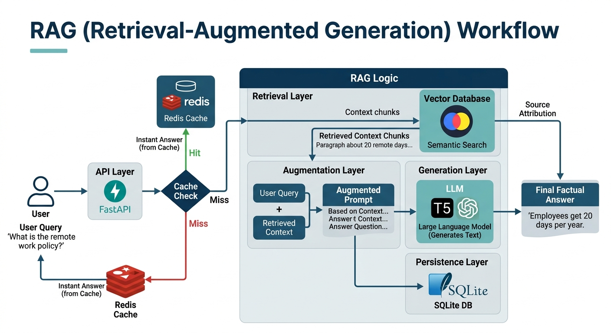

# ai_ops

See the project [README.md](../README.md) for full documentation.

| Method | Path | Description |
|--------|------|-------------|
| `POST` | `/predict` | Sentiment analysis on a text string (DistilBERT) |
| `GET` | `/stream-ai` | Token-by-token streaming AI response |
| `GET` | `/ask` | Cached sentiment analysis — Redis → SQLite → model |
| `POST` | `/classify` | Image classification via ViT, cached by image hash |
| `GET` | `/ask-rag` | RAG question answering using GPT-2 + ChromaDB (5 req/min) |
| `GET` | `/docs` | Interactive Swagger UI (auto-generated) |

## Architecture



```
┌─────────────┐
│  API Request │
└──────┬──────┘
       │
       ▼
┌─────────────────────────────┐
│  1. Cache Layer (Redis)      │
│     Is the answer cached?    │
└──────┬──────────────────────┘
       │ HIT → return response immediately
       │
       │ MISS
       ▼
┌─────────────────────────────┐
│  2. Database Layer (SQLite)  │
│     Was it answered before?  │
└──────┬──────────────────────┘
       │ HIT → re-cache in Redis, return response
       │
       │ MISS
       ▼
┌─────────────────────────────┐
│  3. AI Model                 │
│     Run inference            │
└──────┬──────────────────────┘
       │
       ▼
  Save to SQLite
       │
       ▼
  Cache in Redis (60s TTL)
       │
       ▼
  Return response
```

> For `/ask-rag`, step 3 first retrieves relevant context from **ChromaDB** before passing it to the GPT-2 model.

## Running with Docker (recommended)

### Prerequisites
- [Docker Desktop](https://www.docker.com/products/docker-desktop/)

### 1. Set your Ngrok auth token

Get a free token at [dashboard.ngrok.com](https://dashboard.ngrok.com), then:

```bash
# Linux / macOS
export NGROK_AUTH_TOKEN=<your_token>

# Windows PowerShell
$env:NGROK_AUTH_TOKEN="<your_token>"
```

### 2. Start all services

From the repo root:

```bash
docker compose up --build
```

This starts:
- **`redis`** — Redis 7 server on port `6379`
- **`api`** — FastAPI app on port `8000`

Redis is health-checked before the API starts, so there is no race condition.

### 3. Access the API

| URL | Description |
|-----|-------------|
| `http://localhost:8000/docs` | Swagger UI |
| `http://localhost:8000/redoc` | ReDoc UI |

### Stopping

```bash
docker compose down          # stop containers
docker compose down -v       # stop and remove volumes (clears Redis + SQLite data)
```

## Running locally (without Docker)

### Prerequisites
- Python 3.9+
- A running Redis server (`redis-server` or via Docker: `docker run -p 6379:6379 redis:7-alpine`)

### Install dependencies

```bash
pip install -r requirements.txt
```

### Start the server

```bash
export NGROK_AUTH_TOKEN=<your_token>   # optional, only needed for public tunnel
python -m uvicorn ai_ops.ragapi:app --host 0.0.0.0 --port 8000 --reload
```

## Environment variables

| Variable | Default | Description |
|----------|---------|-------------|
| `REDIS_HOST` | `localhost` | Redis server hostname |
| `REDIS_PORT` | `6379` | Redis server port |
| `NGROK_AUTH_TOKEN` | *(none)* | Ngrok token for public tunnel (optional) |

## Example requests

**Sentiment analysis**
```bash
curl -X POST "http://localhost:8000/predict?text=I+love+this+product"
```

**Image classification**
```bash
curl -X POST "http://localhost:8000/classify" \
     -F "file=@/path/to/image.jpg"
```

**RAG question answering**
```bash
curl "http://localhost:8000/ask-rag?question=How+many+remote+days+do+I+get"
```

**Streaming response**
```bash
curl "http://localhost:8000/stream-ai?prompt=Tell+me+about+AIOps"
```

## Project layout

```
ai_ops/
├── ragapi.py     # FastAPI application (this module)
├── main.py       # CLI entry point
├── collectors/   # Data fetching modules
└── models/       # ML model modules

docker-compose.yml   # Redis + API service definitions
Dockerfile           # Two-stage container build
requirements.txt     # Python dependencies
```
